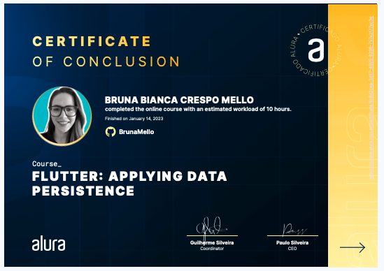
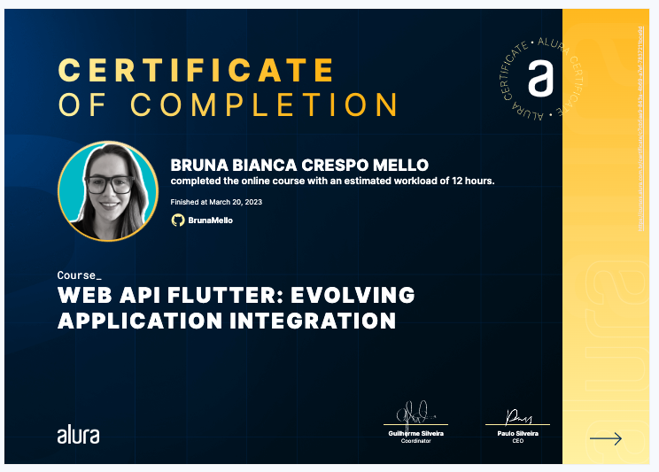

<h1>Flutter: Web API: Integrating your Application</h1>
<h1>Flutter: Web API 2: Evolving Application Integration</h1>

Take this Flutter courses and:

- Identify what a Web API is
- Learn how to integrate a Web API into a journal application
- Use an HTTP library to make requests;
- Understand what UUID, interceptors, loggers, REST, restful and JSON are
- Learn how to configure interceptors and loggers
- Save app information to the internet
- Learn to pick up and show data in the app with the GET request
- Understand how to save an app entry with the POST request
- Change resources with PUT
- Delete resources with DELETE
- Use confirmation dialogs
- Authenticate with login and password
- Use authentication token
- Learn how to deal with common API errors

## 🔨 Project: Simple Journal

Web API - Integrating your Application

Certificate 1: 'https://cursos.alura.com.br/certificate/6c6d2cea-3d57-4905-8296-757e2f77ec3e'
Certificate 2: 'https://cursos.alura.com.br/certificate/c7cb5aa9-843a-4b69-a7ef-7837211bce9d'

